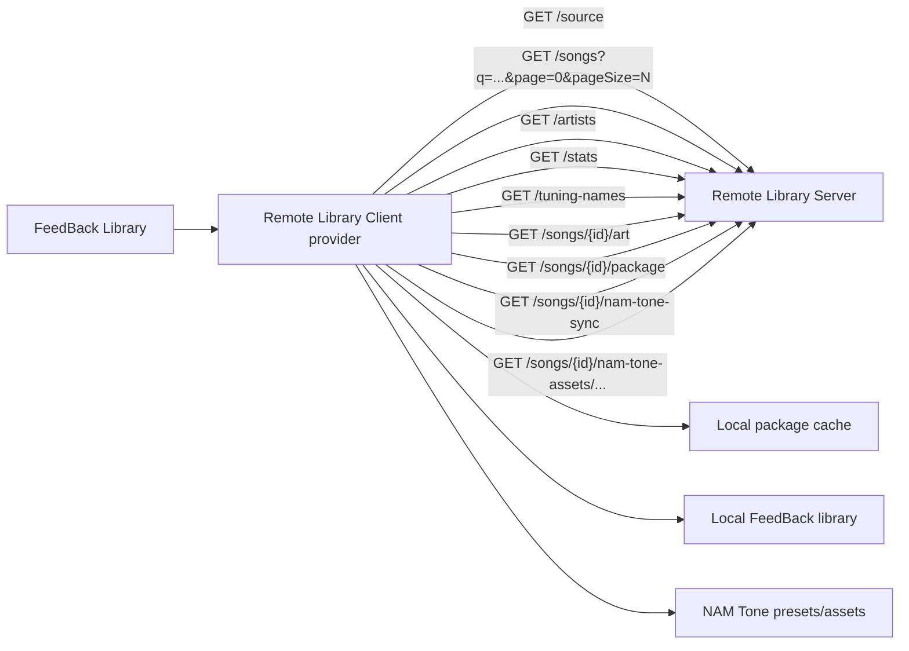

# Remote Library Client

Remote Library Client connects [FeedBack](https://github.com/got-feedback/feedBack) to one or more remote libraries. Each configured source is registered as a FeedBack library provider, so it appears in the core Library source selector. Three source types are supported:

- **Remote Library Server** — a [Remote Library Server](https://github.com/Taynavv/feedback-remote-library-server) URL speaking the full metadata/search/artwork/NAM-tone protocol.
- **Public Google Drive folder** — a public ("anyone with the link") Google Drive folder of package files; paste the folder link and its songs show up in FeedBack. See [Source types](#source-types).
- **Public Proton Drive share** — an anonymous, end-to-end-encrypted Proton Drive share of package files; paste the share link (with its password) and its songs show up in FeedBack. See [Source types](#source-types).

> [!CAUTION]
> **This plugin downloads and imports arbitrary files from whatever server, folder, or share you point it at.**
> A source you connect to — a Remote Library Server, a Google Drive folder, or a Proton Drive share — fully
> controls the metadata and, above all, the **package files** this client downloads into your local library
> and then plays.
> **Only connect to sources run by people you trust.** Don't add a URL a stranger handed you, and
> don't download or play content you can't identify. A malicious or compromised source can hand
> you a hostile file. If you connect to someone sketchy and it costs you — a trojan, junk data,
> whatever — **that is on you, not on this project.** There is no warranty; you use it at your own risk.

## Runtime Model

The plugin declares the core `library` capability as a provider. Its manifest uses provider `operations` (`query-page`, `query-artists`, `query-stats`, `tuning-names`, `get-art`, `sync-song`) because configured sources are exposed through FeedBack's native library provider coordinator. Connection management stays on the plugin's existing screen and backend routes; those UI actions are not declared as a separate capability domain.

## Source types

Every source implements the same FeedBack library-provider interface; the types differ only in how they reach the remote library and how much metadata it exposes. You choose the type when adding a source (**+ → Source type**), and the form adapts — the Access token field only appears for a Remote Library Server.

### Remote Library Server (`slopsmith-direct-library.v1`)

The original type. A [Remote Library Server](https://github.com/Taynavv/feedback-remote-library-server) exposes a rich REST protocol — server-side search and pagination, artist/album grouping, artwork, tunings, and optional NAM-tone sync. Add its base URL (see [Usage](#usage)).

### Public Google Drive folder (`google-drive-public.v1`)

A public ("anyone with the link", no login) Google Drive **folder** of package files. Choose **Google Drive** in the type picker and paste the folder share link — e.g. `https://drive.google.com/drive/folders/<id>` — and the client:

- **enumerates** the folder and lists its `.feedpak` (or legacy `.sloppak`) files;
- **derives metadata from the filenames.** Community folders follow an `Artist - Album - Title.feedpak` convention, so artist / album / title come from the name — there is no server API, artwork, tuning, or NAM-tone data to read;
- **downloads** a song into your local library the first time you play it.

No Google login and no API key are required: enumeration and download run on the same stdlib HTTP stack (redirect-SSRF guard + size caps) as every other request, with no third-party dependency.

**Playing a song.** FeedBack core time-boxes the sync step to a fraction of a second, which an internet download cannot meet — so the download runs in the background. Click a not-yet-downloaded song and you get a **"Downloading…"** notification, then a **"Ready to play"** notification when it lands; click it again to play. A song already in your library plays on the **first** click and shows its artwork, exactly like a local song.

Notes and limits:

- The folder must be shared as **"anyone with the link."**
- Metadata quality depends on the filename convention; oddly-named files still appear, just with a best-effort artist/title.
- Google temporarily **rate-limits a very popular file** (roughly 24 hours) when many people download it; the client surfaces a clear "try again later" message rather than a cryptic failure.

### Public Proton Drive share (`proton-public.v1`)

An anonymous, **end-to-end-encrypted** Proton Drive **public share** of package files. Choose **Proton Drive** in the type picker and paste the share link — e.g. `https://drive.proton.me/urls/<token>#<password>` — and the client:

- **authenticates anonymously** to the share (an SRP handshake against the share token — no Proton account, no login);
- **decrypts the folder listing** and lists its `.feedpak` (or legacy `.sloppak`) files. Community shares follow an `Artist-Title.feedpak` (or `Artist - Album - Title.feedpak`) convention, so artist / title come from the filename — there is no server API, artwork, or tuning data;
- **downloads and decrypts** a song's content blocks into your local library the first time you play it, in the background (exactly like Google Drive — see below).

Paste the **whole** share link, including the `#…` password fragment — that password is the decryption key and never leaves your machine (it is stored with the source and stripped from every response, like an access token). No Proton login is required.

**Playing a song** works exactly like the Google Drive type: the first click on a not-yet-downloaded song shows a **"Downloading…"** notification and fetches + decrypts in the background; a **"Ready to play"** notification lands when it's done; click again to play. Already-downloaded songs play on the first click.

Notes and limits:

- The share must be a **public** ("anyone with the link") share, and the link must include its **generated password** (the `#…` fragment). Shares with a separate custom password are not supported yet.
- This is the one source type with a **native dependency**: Proton's encryption requires `bcrypt` and `pysequoia`, listed in [requirements.txt](requirements.txt) and installed by FeedBack on load. The other two source types have no dependencies, so they keep working even where these can't be installed.
- Proton's public-share API is undocumented and changes over time; if listing suddenly fails, the plugin may need an update.

## Flow

The **Remote Library Server** type speaks this REST protocol. (The **Google Drive** type has no server — it enumerates a public folder and downloads packages directly; see [Source types](#source-types).)



## Usage

1. Install this client plugin in FeedBack.
2. Open **Remote Client**, click **+**, and choose a **Source type**:
   - **Google Drive** — paste a public ("anyone with the link") folder link. No server, login, or token required.
   - **Proton Drive** — paste a public share link *including its `#…` password*. No Proton account or login required.
   - **Remote Library Server** — enter the server's base URL (plus an access token if it requires one); see [Adding a Remote Library Server](#adding-a-remote-library-server).
3. Add a label if you like, click **Add**, then open the main **Library** screen and pick your source from the source selector.
4. Click a song to load it into your local library and play it. A song from a Google Drive folder or a Proton Drive share downloads (and, for Proton, decrypts) in the background the first time you play it (see [Source types](#source-types)); a Remote Library Server song loads straight from the server.

### Adding a Remote Library Server

1. Install the [Remote Library Server](https://github.com/Taynavv/feedback-remote-library-server) plugin on the machine that owns the library, and start it on its own port.
2. In **Remote Client → + → Remote Library Server**, enter its base URL — e.g. `studio.local`, `http://127.0.0.1:8765`, or `http://192.168.1.X:8765`. If you omit the scheme, the client tries `http` then `https` on port `8765`; if you give a scheme but no port, it tries the URL as written then falls back to the same scheme on port `8765`.
3. Optional: enable **NAM tones** on the source to sync mapped NAM presets, `.nam` models, and IR `.wav` files when songs download.

NAM tone sync is best-effort and non-fatal: if the server doesn't share tone assets, or one fails to download, the song package still syncs normally and the result carries a `toneSync` status object. (NAM tones are a Remote Library Server feature — Google Drive folders don't provide them.)

## Authentication & security

- **Access tokens.** If a Remote Library Server requires a bearer token, the client prompts for it when you add the source (and shows a **Token required** badge otherwise). Set, change, or clear a token later with the **key** button on the source card. The token is stored locally with the source and sent as `Authorization: Bearer <token>` (or a `?token=` query parameter for non-ASCII tokens, which HTTP headers cannot carry); it is never echoed back to the browser.
- **Redirect protection.** By default the client refuses to follow a server redirect that pivots to a different internal / loopback host (an SSRF guard). If a trusted server legitimately relies on such a redirect, enable **Allow unsafe redirects** on that source. Only add servers you trust — see [SECURITY.md](SECURITY.md).

## Development

```bash
python -m venv .venv
# Activate the venv:  Windows: .venv\Scripts\activate  |  macOS/Linux: source .venv/bin/activate
pip install pytest fastapi httpx ruff
ruff check .
pytest -q
```

## Heritage

Remote Library Client is a community port of a plugin originally written by the authors of
[FeedBack](https://github.com/got-feedback/feedBack). Full credit for the original design and
implementation goes to them; this repository — maintained by [@Taynavv](https://github.com/Taynavv)
— is an independent, unofficial port of that work to the current FeedBack plugin API.

If FeedBack's authors would like this repository, I'm glad to hand it over — and if an official
port is published, I'll take this one down.

## AI disclosure, warranty, and contributions

**This port was built with heavy use of AI coding tools.** The large majority of the code here was
written by an AI assistant working under human direction, with human review and hands-on testing
against a real FeedBack install — but you should read it with the same skepticism you'd apply to any
code of unknown provenance.

**There is no warranty.** This is open-source software provided **as-is**, without warranty of any
kind, express or implied — see sections 15 and 16 of the [LICENSE](LICENSE). It downloads and imports
files from remote servers you configure and plays them inside FeedBack; if a server you trusted hands
it something hostile, or it breaks something, you get to keep both pieces.

**Contributions are welcome.** If you find a bug or want a feature, open an issue — or better, submit
a pull request. Small, focused PRs with a description of what was tested are the easiest to review. By
contributing you agree your changes are licensed under the same AGPL-3.0 terms.

## License

AGPL-3.0-or-later — see [LICENSE](LICENSE).