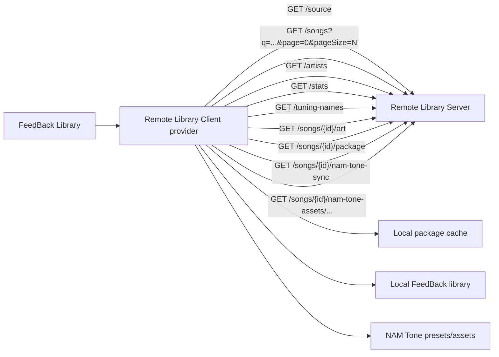

# Remote Library Client

Remote Library Client connects [FeedBack](https://github.com/got-feedback/feedBack) to one or more direct [Remote Library Server](https://github.com/Taynavv/feedback-remote-library-server) URLs. Each configured server is registered as a FeedBack library provider, so it appears in the core Library source selector.

## Runtime Model

The plugin declares the core `library` capability as a provider. Its manifest uses provider `operations` (`query-page`, `query-artists`, `query-stats`, `tuning-names`, `get-art`, `sync-song`) because configured Remote Library Server URLs are exposed through FeedBack's native library provider coordinator. Connection management stays on the plugin's existing screen and backend routes; those UI actions are not declared as a separate capability domain.

## Flow



## Usage

1. Install the [Remote Library Server](https://github.com/Taynavv/feedback-remote-library-server) plugin on the machine that owns the library.
2. Start that server on its own port.
3. Install this client plugin on the browsing machine.
4. Open **Remote Client** and add the server base URL, such as `studio.local`, `http://127.0.0.1:8765`, or `http://192.168.1.X:8765`. If you omit the scheme, the client tries `http` and then `https` on port `8765`. If you give a scheme but no port, it tries the URL as written and then falls back to the same scheme on port `8765`.
5. Open the main Library screen and choose the remote source from the source selector.
6. Optional: enable **NAM tones** for the source to sync mapped NAM presets, `.nam` models, and IR `.wav` files when songs are downloaded.
7. Click a remote song to load it into the local library cache and play it.

NAM tone sync is best-effort and non-fatal. If the remote server does not share tone assets, or a tone asset fails to download, the song package still syncs normally and the sync result includes a `toneSync` status object.

## Authentication & security

- **Access tokens.** If a Remote Library Server requires a bearer token, the client prompts for it when you add the source (and shows a **Token required** badge otherwise). Set, change, or clear a token later with the **key** button on the source card. The token is stored locally with the source and sent as `Authorization: Bearer <token>` (or a `?token=` query parameter for non-ASCII tokens, which HTTP headers cannot carry); it is never echoed back to the browser.
- **Redirect protection.** By default the client refuses to follow a server redirect that pivots to a different internal / loopback host (an SSRF guard). If a trusted server legitimately relies on such a redirect, enable **Allow unsafe redirects** on that source. Only add servers you trust — see [SECURITY.md](SECURITY.md).

## Development

```bash
python -m venv .venv
# Activate the venv:  Windows: .venv\Scripts\activate  |  macOS/Linux: source .venv/bin/activate
pip install pytest fastapi httpx ruff
ruff check .
pytest -q
```

## License

AGPL-3.0-or-later — see [LICENSE](LICENSE).