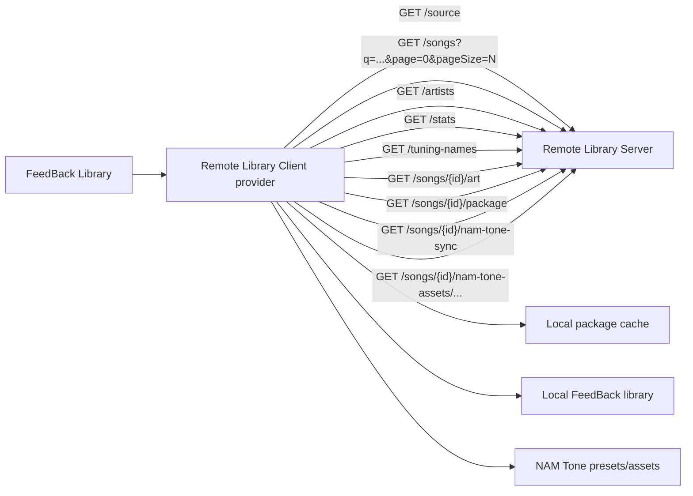

# Remote Library Client

Remote Library Client connects [FeedBack](https://github.com/got-feedback/feedBack) to one or more remote libraries. Each configured source is registered as a FeedBack library provider, so it appears in the core Library source selector. Two source types are supported:

- **Remote Library Server** — a [Remote Library Server](https://github.com/Taynavv/feedback-remote-library-server) URL speaking the full metadata/search/artwork/NAM-tone protocol.
- **Public Google Drive folder** — a public ("anyone with the link") Google Drive folder of package files; paste the folder link and its songs show up in FeedBack. See [Source types](#source-types).

> [!CAUTION]
> **This plugin downloads and imports arbitrary files from whatever server or folder you point it at.**
> A Remote Library Server — or a Google Drive folder — you connect to fully controls the metadata and,
> above all, the **package files** this client downloads into your local library and then plays.
> **Only connect to sources run by people you trust.** Don't add a URL a stranger handed you, and
> don't download or play content you can't identify. A malicious or compromised server can serve
> you a hostile file. If you connect to someone sketchy and it costs you — a trojan, junk data,
> whatever — **that is on you, not on this project.** There is no warranty; you use it at your own risk.

## Runtime Model

The plugin declares the core `library` capability as a provider. Its manifest uses provider `operations` (`query-page`, `query-artists`, `query-stats`, `tuning-names`, `get-art`, `sync-song`) because configured sources are exposed through FeedBack's native library provider coordinator. Connection management stays on the plugin's existing screen and backend routes; those UI actions are not declared as a separate capability domain.

## Source types

Every source implements the same FeedBack library-provider interface; the types differ only in how they reach the remote library and how much metadata it exposes. The plugin picks a type from the URL you add — no extra choice to make.

### Remote Library Server (`slopsmith-direct-library.v1`)

The original type. A [Remote Library Server](https://github.com/Taynavv/feedback-remote-library-server) exposes a rich REST protocol — server-side search and pagination, artist/album grouping, artwork, tunings, and optional NAM-tone sync. Add its base URL (see [Usage](#usage)).

### Public Google Drive folder (`google-drive-public.v1`)

A public ("anyone with the link", no login) Google Drive **folder** of package files. Paste the folder share link — e.g. `https://drive.google.com/drive/folders/<id>` — and the client:

- **enumerates** the folder and lists its `.feedpak` (or legacy `.sloppak`) files;
- **derives metadata from the filenames.** Community folders follow an `Artist - Album - Title.feedpak` convention, so artist / album / title come from the name — there is no server API, artwork, tuning, or NAM-tone data to read;
- **downloads** a song into your local library on demand when you play it.

No Google login and no API key are required: enumeration and download run on the same stdlib HTTP stack (redirect-SSRF guard + size caps) as every other request, with no third-party dependency. Notes and limits:

- The folder must be shared as **"anyone with the link."**
- Metadata quality depends on the filename convention; oddly-named files still appear, just with a best-effort artist/title.
- Google temporarily **rate-limits a very popular file** (roughly 24 hours) when many people download it; the client surfaces a clear "try again later" message rather than a cryptic failure.

## Flow



## Usage

1. Install the [Remote Library Server](https://github.com/Taynavv/feedback-remote-library-server) plugin on the machine that owns the library.
2. Start that server on its own port.
3. Install this client plugin on the browsing machine.
4. Open **Remote Client** and add the server base URL, such as `studio.local`, `http://127.0.0.1:8765`, or `http://192.168.1.X:8765`. If you omit the scheme, the client tries `http` and then `https` on port `8765`. If you give a scheme but no port, it tries the URL as written and then falls back to the same scheme on port `8765`.
5. Open the main Library screen and choose the remote source from the source selector.
6. Optional: enable **NAM tones** for the source to sync mapped NAM presets, `.nam` models, and IR `.wav` files when songs are downloaded.
7. Click a remote song to load it into the local library cache and play it.

NAM tone sync is best-effort and non-fatal. If the remote server does not share tone assets, or a tone asset fails to download, the song package still syncs normally and the sync result includes a `toneSync` status object.

## Authentication & security

- **Access tokens.** If a Remote Library Server requires a bearer token, the client prompts for it when you add the source (and shows a **Token required** badge otherwise). Set, change, or clear a token later with the **key** button on the source card. The token is stored locally with the source and sent as `Authorization: Bearer <token>` (or a `?token=` query parameter for non-ASCII tokens, which HTTP headers cannot carry); it is never echoed back to the browser.
- **Redirect protection.** By default the client refuses to follow a server redirect that pivots to a different internal / loopback host (an SSRF guard). If a trusted server legitimately relies on such a redirect, enable **Allow unsafe redirects** on that source. Only add servers you trust — see [SECURITY.md](SECURITY.md).

## Development

```bash
python -m venv .venv
# Activate the venv:  Windows: .venv\Scripts\activate  |  macOS/Linux: source .venv/bin/activate
pip install pytest fastapi httpx ruff
ruff check .
pytest -q
```

## Heritage

Remote Library Client is a community port of a plugin originally written by the authors of
[FeedBack](https://github.com/got-feedback/feedBack). Full credit for the original design and
implementation goes to them; this repository — maintained by [@Taynavv](https://github.com/Taynavv)
— is an independent, unofficial port of that work to the current FeedBack plugin API.

If FeedBack's authors would like this repository, I'm glad to hand it over — and if an official
port is published, I'll take this one down.

## AI disclosure, warranty, and contributions

**This port was built with heavy use of AI coding tools.** The large majority of the code here was
written by an AI assistant working under human direction, with human review and hands-on testing
against a real FeedBack install — but you should read it with the same skepticism you'd apply to any
code of unknown provenance.

**There is no warranty.** This is open-source software provided **as-is**, without warranty of any
kind, express or implied — see sections 15 and 16 of the [LICENSE](LICENSE). It downloads and imports
files from remote servers you configure and plays them inside FeedBack; if a server you trusted hands
it something hostile, or it breaks something, you get to keep both pieces.

**Contributions are welcome.** If you find a bug or want a feature, open an issue — or better, submit
a pull request. Small, focused PRs with a description of what was tested are the easiest to review. By
contributing you agree your changes are licensed under the same AGPL-3.0 terms.

## License

AGPL-3.0-or-later — see [LICENSE](LICENSE).